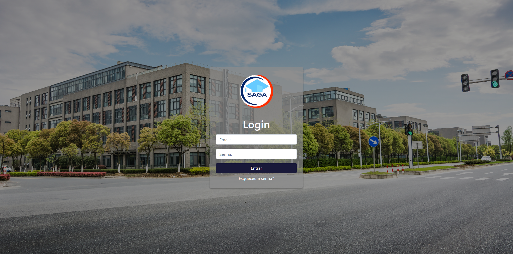

  # 🏫 Sistema de Gestão Escolar - SAGA
  
  

Sistema completo para gerenciamento de escolas, com funcionalidades robustas de administração de alunos, turmas, professores e matrículas. Ideal para escolas de pequeno e médio porte que desejam informatizar seus processos com uma solução web moderna e escalável.

---

## 🧾 Índice

- [🧠 Sobre o Projeto](#-sobre-o-projeto)  
- [🛠️ Tecnologias Utilizadas](#-tecnologias-utilizadas)  
- [📥 Instalação](#-instalação)  
- [🚀 Como Rodar o Projeto](#-como-rodar-o-projeto)  
- [📌 Funcionalidades](#-funcionalidades)  
- [🖼️ Imagens](#-imagens)  
- [🤝 Contribuições](#-contribuições)  
- [🧑‍💻 Desenvolvedores](#-desenvovedores)  
- [📄 Licença](#-licença)  

---

## 🧠 Sobre o Projeto

O **Sistema de Administração e Gestão Acadêmica** foi desenvolvido para facilitar a administração acadêmica, proporcionando uma interface intuitiva tanto para o time pedagógico quanto administrativo.  
A estrutura do sistema é modular e escalável, permitindo expansões futuras como integração de boletins, presença, mensagens internas e mais.

---

## 🛠️ Tecnologias Utilizadas

### 🔙 Backend
- [Node.js](https://nodejs.org) – Ambiente de execução JavaScript
- [Express.js](https://expressjs.com) – Framework web minimalista
- [Prisma ORM](https://www.prisma.io) – ORM moderno e tipado
- [Supabase](https://supabase.com) – Plataforma como serviço (PaaS) com PostgreSQL
- [Dotenv](https://www.npmjs.com/package/dotenv) – Variáveis de ambiente

### 🎨 Frontend
- HTML5 + CSS3
- JavaScript Vanilla (ES6+)
- Layout responsivo com Flexbox/Grid

---

## 📥 Instalação

### 1️⃣ Clone o repositório
```bash
git clone https://github.com/SAGA-TCC/SAGA.git
cd SAGA
```

### 2️⃣ Instale as dependências
```bash
npm install
```

### 3️⃣ Configure as variáveis de ambiente
Crie um arquivo `.env` na raiz com as seguintes variáveis:

```env
DATABASE_URL="sua-url-do-banco-de-dados"
PORT=3000
```

> ⚠️ **Atenção:** A URL do Supabase pode ser obtida diretamente na dashboard do seu projeto.

---

## 🚀 Como Rodar o Projeto

### 🔌 Backend (API REST)
```bash
npx prisma generate
npx prisma migrate dev --name init
npm run dev
```

Servidor disponível em: `http://localhost:3000`

### 🌐 Frontend
Abra o arquivo `index.html` localizado na pasta `login/` no seu navegador ou utilize um servidor como o [Live Server](https://marketplace.visualstudio.com/items?itemName=ritwickdey.LiveServer) (VSCode).

---

## 📌 Funcionalidades

- ✅ Cadastro, edição e remoção de **alunos**
- ✅ Gerenciamento de **professores**
- ✅ Criação e atribuição de **turmas**
- ✅ Relacionamento entre alunos, professores e turmas
- ✅ Matrículas
- ✅ Lançamento de notas
- ✅ Sistema de frequência

---

## 🖼️ Imagens

### 📋 Chamada  


### 🧑 Cadastro de Professores  


### 🏫 Gerenciamento de Turmas  


---

## 🤝 Contribuições

Contribuições são bem-vindas! Sinta-se livre para abrir uma _issue_ ou enviar um _pull request_.

1. Fork este repositório  
2. Crie sua feature (`git checkout -b minha-feature`)  
3. Commit suas alterações (`git commit -m 'feat: minha nova feature'`)  
4. Push para a branch (`git push origin minha-feature`)  
5. Abra um Pull Request  

---

## 🧑‍💻 Desenvolvedores 

Desenvolvido por [Felipe Farias](https://github.com/Felipe-dev01), Brenno Mello, Jéssica Oliveira e Hugo Rocha.  

---

## 📄 Licença

Este projeto está sob a licença [MIT](LICENSE).

---
